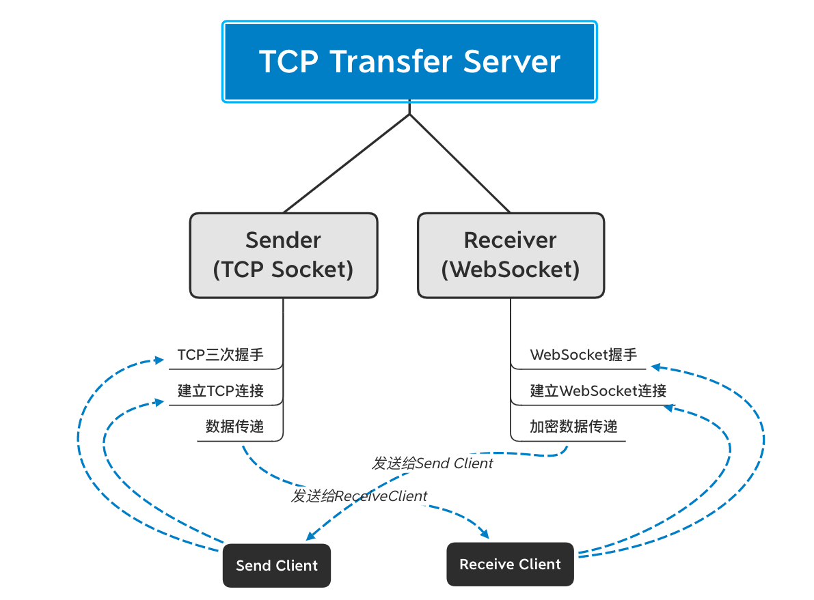
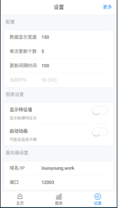
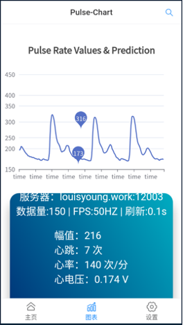
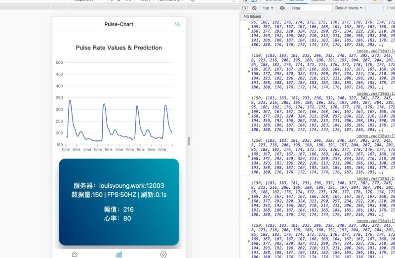

# PCA *(Pulse & Connect & Analyse)*

- Pulse Wave Display
- Connect Server with protocol transfer (TCP 2 WebSocket )
- Analysis of eigenvalues

## 1. 介绍

**光学脉搏传感系统Hybrid App，Web App**


但是基于对脉搏信号的分析能为人们提供一个健康的检测，实时地掌握自己的健康状况，而且考虑到移动通信设备的app具有便捷性和实用性，根据以上的想法要求设计了光学脉搏传感系统app--脉搏悦动，硬件设备是利用光纤传感器中光纤的透射性能实现对脉搏信号的采集，软件系统则是利用JavaScript语言完成app的程序编译，此app能从传感器中接收信号绘制脉搏波形图，并识别脉搏的部分特征点。

**关键词：** 光纤传感器，app，JavaScript

## 2. 前置准备

中转服务器 - **[TCP-Transfer-Server 项目地址](https://gitee.com/louisyoung1/tcp_transfer_server)** （基于TCP协议，中转TCP连接到WebSocket连接）



确认启动中转服务器，打开光学脉搏传感器，连接上服务器，下载安卓安装包安装后，打开APP设置即可使用。

## 3. 启动Web项目

### 安装

```shell
git clone https://github.com/louisyoungx/pulse-connect-analyse.git

cd pulse-connect-analyse

npm install
```

### 开发环境下编译和热更新

```shell
npm start
```

### 编译打包

```
npm build
```

## 4. 设置

从app设置界面可以看到，用户可以根据根据实际需要自行在“配置”中设置数据显示宽度、单次更新个数和更新时间（从图3-8中可以看到本次运行测试使用的数据为：数据显示宽度150、单次更新个数5、更新间隔时间100）。



当要开启运行显示图标和特征值时，需要开启图表设置中的显示特征值和启动动画，那样就能在图表界面运行出显示特征值得图表

### 5. 查看数据

在图表界面中能根据我们设置的系数显示特征值和脉搏信号的实时更新折线图动画，且配置不会改变，即配置会一直保留至完成运行测试。在app运行之前服务器会显示“Receive Close”,而当调至图表界面连接服务器成功之后，会看到显示“Receive Connection Built”,即接收的客服端已经连接上了，然后就能正常的接收、显示数据并进行计算。



设计的app在某一时刻收集的数据如图所示，采集到的数据为脉搏波的幅值为216，心跳7次，心率（脉率）为140次/分钟，心电压为0.174V，其中还有两个特征值:173和316。

##### console.log显示


